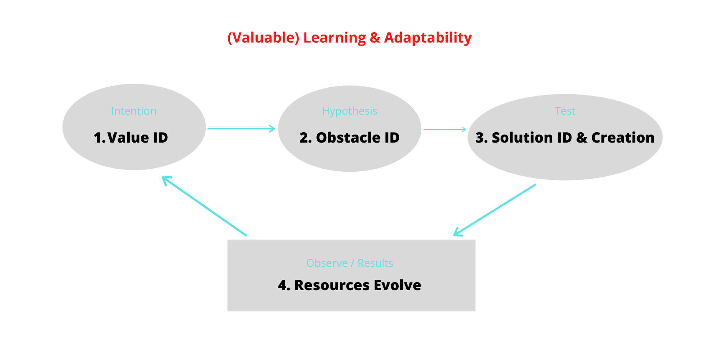

## A Few Challenges and A Few Potential Solutions

This page is set aside to present what I think are the biggest challenges we face today as a species, and more importantly, suggest a few ideas to solve them.

I'm working on a couple of these, but most I'm not. I believe that all of these are not only big problems, but (therefore) also big business opportunities, if you're that way inclined.

If you want to "win" in business, it seems important to find the intersection of your passion, your unique experience and skillsets (what could you genuinely be the best in the world at, where are you right and everyone else is wrong), and a massive (billion person) problem.

Also, don't think small. Start small, but try to make your solution technologically-based so it can scale exponentially. Coding is pretty much essential as a founder nowadays, I would suggest. Or at least co-found with someone smart, determined, and [great.](http://www.paulgraham.com/gh.html){:target="_blank"} 

Not that it has to be a business. It could be a non-profit, or a community project, or a DAO ([decentralized autonomous organisation](https://en.wikipedia.org/wiki/Decentralized_autonomous_organization){:target="_blank"} - in theory, I really like these and think they have HUGE potential - we'll see about practice).

Anyways, I've got more on business / systems elsewhere on this site, and some good book recommendations lying around too. For now, let's get into it...

***

### Cycle of importance

We want to identify the most important challenges at any one moment, and solve them as effectively and quickly as possible. We might call this adaptability. So...

Let's walk through this model I've been playing with.

**1. Value Identification**

Perhaps the most important thing to work on, the most important question to answer, the most important challenge to solve, is... Well, that! *What's important.*

Before we can solve a problem, we need to know what things are problems and what aren't. And if we define a problem as something that keeps us from something else we value as important, it follows that, in order to do meaningful things, we should look at what's important (if anything), and why.

This starts to fall into the realms of philosophy, ethics, metaphysics, etc.

...

A more succinct version of this here:

{

Out of the above 4, I'd suggest that the values piece is the one that is most often missed. We don't ask "why", we don't question our intentions, we don't go deeper.

This is dangerous, because we can quite quickly find ourselves moving faster and faster down roads that we may not want to go down.

The Farnam Street blog summarizes this beautifully in one of their core principles - "Direction over speed." Or quality over quantity.

And really, it's also not just about thinking about the direction all the time. It's both - direction, move forward; action, course correct. This is adaptability, or learning, at it's core.

What gets in the way for us is a tendency to get stuck in one way of doing things without re-examining things, without *unlearning* - and perhaps also a lack of feedback around the right things, not measuring what matters.

So what is really required is being able to continually balance massive "doing" with deep awareness and "being", knowing and not-knowing, learning and unlearning...

In fact, not just to balance them, but to have them feed into each other reciprocally. Where we use the doing as feedback, and use the chaos to drive us into the present more deeply - and in return, the presence fills our doing with quality, and maximizes our odds of doing useful work.

(There’s also a lot of talk about values, but relatively little actual reflection and development - we tend to project the lower values. But try this. Try sitting down with a pen and paper for 5 minutes (or an hour), allowing your mind to clear somewhat, and then writing down any thoughts that come, especially when you realize you've been lost in thought. Doesn't have to be word for word, just enough to get the general subject matter across. Now take a look at those thoughts... where do they seem to be taking you to and from? What problems are they trying to solve? What are the feelings underneath them? Are there any themes or patterns that emerge? If we're honest with ourselves, we tend to convince ourselves most of the time that our thoughts and resulting actions are selfless, to help others, but really, deep down, it's out of a fear of not being enough, or not being loved... feelings of insecurity and shame and hurt from the past that we never want to feel again.

When these are our values, the forces that are driving us and unconsciously shaping our decisions, then this are what we will continue to move towards; namely, separation, lack, competition, win-lose decisions.

To be aware. Not to lose sight of the Why, the enjoyment...)

}

**2. Obstacle Identification**

Here, it's not just about identifying the obstacles and problems...

But identifying the few that are the highest leverage to solve.

It's about etiology, and not mistaking symptoms for problems, but diving down to the root.

It's also about timing - which are ripe for solution, and which need another decade in the incubator?

There are many factors that play into the timing... (people, tech, resources, etc.)

...

Also, vision / intention. They are almost simultaneous? A vision/intention implies that there is a difference between now and then.

Or do we just set the value and use subc?
Use subc, to paint the vision/intention, and then the obstacles are there.

Maybe value / problem

and Vision / obstacle ?

Do we even solve problems? What is a problem? Is it more of a continuum of value/intention/vision, and we just move more and more into that?

....

**3. Solution Creation**

With the currently (and soon-to-be) available tech and resources, how can we solve this problem? How can we create a system, a product, and/or a service to overcome this challenge?

As we move from step 2 to 3, we become concerned with how to optimally organize our resources, including our somewhat primary resources of energy and intelligence / skill / ability / information... people + tech + data, w/ HI... 

Economics1 as simply a part of this organization, this overarching system.

Inc. Sub-problems. Though this is secondary to the value, and we must be able to change on a dime, without getting attached to it (and so too with the values)... We too often get lost in the details - we need to zoom out more often. (Not just working on a project, but why am I working on this project? What plan is this a larger part of? And whose? Why does this company exist, is it doing important work - is it to solve a problem primarily or turn a profit?)

**4. Resources Evolve**

Perhaps more generalized / accurate at this point is "resources & situation change", or even just "Life Evolves"

Ideally, if we've done "good" things, and we chose to value our resources, the resources we have at our disposal will develop, evolve, increase.

This gives us a better ability to solve the old problems, and any new problems that we are now identifying with the changing landscape.

Again, this includes the primary resources like energy, intelligence / wisdom / ability / skill, tech, data/info, etc.

This is at the bottom of the diagram because, although it's last, it also provides the foundation for the others.

I've put it last in the sequence because I think direction or vector or quality is more important than speed or size of impact.

*

*

Then a walkthrough of my / our current ideas and research (linked companies etc.;)

Primary value - happiness, enjoyment, being madly in love with life?

Data, two way...

General idea of cutting out middlemen and approaching zero cost for everything... (DAOs?)

4 - Balance, and enjoyment of life -> intelligence and energy... 

So perhaps. Organizing, group flow (cycle)... v important... 

*

*

Tiers of importance of things to work on… 

What guides the tiers themselves - philosophy, as humans, as/with AI (perhaps Swarm), + as HI - eg. care, connectedness, transcend & include… 
The contents of the tiers, and updating this dynamically
Enjoyment of living - First and foremost, the highest leverage thing you can do is to focus on falling in love with life.

The optimal organization of primary resources (perhaps energy/information/intelligence) - including collaboration - into the contents, and updating this dynamically
The continued development of the resources (energy/information/intelligence) - eg. enjoyment, health, relationships, (finances/)work/service, (machine/HI) learning - group flow cycle… 
Extracting the optimally balanced (eg. short/long term) output/creativity from the resources
The improvement of feedback loops for the above.

Then into other stuff, eg.

Bio/nanotech (perhaps above…) as platforms
Companies sharing our data + their insights with us so we can learn from it too - win-win
Economics - importance of aligning short & long term - and removing the barriers to this (stress, fear, cortisol, -> lack of perspective and short-term thinking) - and incentivizing this.
Energy - clean, cheap
Self-sufficiency and efficiency (through skills & systems) in basic needs… for all. Shelter, food, water, health/immunity and sanitation, money, education, sustainable living, consumption & healing (short & long-term) for all life, systems of connection, communication, and organization

***

1 - A word on the demonetization of money - it's very conceivable to me that we solve the basic challenges of life sufficiently well enough within the next few decades for all of us such that it can be done without work (or with gradually less and less work)... And when we're abundantly happy and at peace within ourselves, and deeply connected, such that we don't need to get newer advances before others (and where time from available to 1 to democratized gets ever smaller), where money has served its purpose, and we let go of it... We'd still use money as a means of exchange, but it's just a completely different ball-game. We don't exactly *need* to work for money, but we choose to because we've found what we love to do and it doesn't feel like work at all.

Example of autonomous driving (public = private), vertical / lab agriculture, 3D printed houses, remote work... Supply going way up

Supply of required skills going way up too, through AI and education (internet, language, VR/AR)... 

Simply: Money as scarce, in-demand resources... What if the important resources are in abundance, and the the non-important things lose their demand?

There's a lot of concern about being outcompeted for work by AI... But isn't that the point?
The point of "work" in the normal sense of the word is to solve problems, to earn a living, to enjoy life...
It's just a shift in paradigm, in values. We'd no longer need to run somewhere. We can just relax. We can still work hard, but not because we have to, but because we want to - and we can work on whatever we want. And perhaps we solve problems - although perhaps we eventually write programs / ask AI to automatically identify and solve problems for us. But perhaps we just express ourselves, have fun, learn new things, explore within and without, connect deeply. We think we'd get bored, go crazy... but what if you didn't? What if we could actually learn to be at peace? And you can still do stuff, you just don't need to...
Point of society stuck in doing, sense of working so then you can relax, doing something now so you can then chill out and be...

